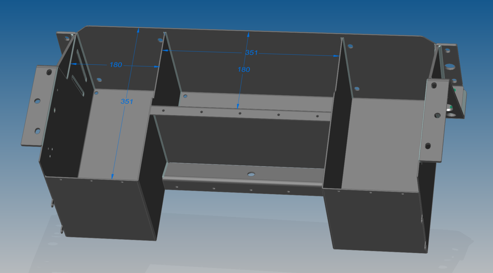

# Batteriekasten CityEL – LiFePO4 (Thrige Titan)

## Projektbeschreibung

Dieses Repository enthält CAD-Daten für einen **Batteriekasten zum Nachbau**
für **CityEL-Fahrzeuge mit Thrige-Titan-Antrieb**, ausgelegt für moderne
**LiFePO₄-Zellen**.

Der originale CityEL-Batteriekasten ist für drei 100 Ah Bleibatterien
konzipiert. Aufgrund der geringen Energiedichte und Lebensdauer von
Bleibatterien wurden diese Kästen im Laufe der Zeit häufig umgebaut oder
sind durch Korrosion beschädigt worden.

Ziel dieses Projekts ist es, einen **robusten, nachbaubaren Batteriekasten**
bereitzustellen, der den Einsatz zeitgemäßer LiFePO₄-Zellen ermöglicht und
sich für die Restaurierung, den Umbau und den langfristigen Erhalt von
CityEL-Fahrzeugen eignet.

---

## Technische Eckdaten

- Fahrzeug: **CityEL**
- Antrieb: **Thrige Titan**
- Zelltyp: **EVE LiFePO₄ 230 Ah, 3,2 V**
- Varianten:
  - **14 Zellen** (erprobt)
  - **16 Zellen** (Work in Progress, noch nicht erprobt)

---

## Projektstatus

- **14-Zellen-Variante**
  - In einem Fahrzeug verbaut und erprobt
  - Grundlage ist die ursprüngliche Konstruktion aus der Community

- **16-Zellen-Variante**
  - Basiert geometrisch auf der 14-Zellen-Version
  - Aktuell **nicht erprobt**
  - Gilt als *Work in Progress*

---

## Enthaltene Inhalte

Aktuell im Repository enthalten:
- 3D-Geometrie (STEP)
- Blechbiegeteile / Abwicklungen (STEP / STL)
- Grundlegende Kasten-Geometrie

Nicht enthalten bzw. noch in Arbeit:
- Montageanleitungen
- Schweißreihenfolgen
- Material- und Toleranzempfehlungen
- Einbauhinweise im Fahrzeug

Diese Punkte befinden sich im Aufbau und können durch die Community ergänzt
werden.

---

## Entstehung und Community-Bezug

Die Konstruktion ist aus der praktischen Arbeit innerhalb der CityEL- und
Elektroauto-Community entstanden.

Der ursprüngliche Diskussions- und Entwicklungsthread befindet sich im
Elektroauto-Forum:

https://elektroauto-forum.de/beitrag/batteriekasten-nachbau-f%C3%BCr-perm-und-thrige-titan-antrieb.470475/

Der ursprüngliche Autor der **14-Zellen-Variante** ist **Zürcher** aus dem
Forum.  
Die hier veröffentlichte **16-Zellen-Variante** baut auf dieser Arbeit auf
und wird gemeinschaftlich weiterentwickelt.

Dieses GitHub-Repository stellt die **maßgebliche Referenz** für die aktuellen
CAD-Daten und Lizenzbedingungen dar. Der Forum-Thread dient der Diskussion,
historischen Einordnung und dem Erfahrungsaustausch.

---

## CAD-Formate

Die Konstruktion wurde ursprünglich mit **Solid Edge** erstellt.
Veröffentlicht werden neutrale Austauschformate:

- STEP (parametrische Geometrie)
- STL (z. B. für Visualisierung / Fertigung)

Native Solid-Edge-Quelldateien sind nicht Bestandteil dieses Repositories.

---

## Lizenz und Nutzung

Die in diesem Repository veröffentlichten CAD-Daten werden unter der Lizenz  
**Creative Commons Attribution–NonCommercial–ShareAlike 4.0 International
(CC BY-NC-SA 4.0)** bereitgestellt.

Das bedeutet:
- freie Nutzung, Weitergabe und Anpassung
- Nachbauten für private oder gemeinschaftliche Zwecke erlaubt
- **keine kommerzielle Nutzung zur Gewinnerzielung**
- abgeleitete Arbeiten müssen unter derselben Lizenz stehen

Eine Nutzung, die dem Erhalt, Betrieb oder der Instandsetzung von
CityEL-Fahrzeugen dient (z. B. Kostenumlagen ohne Gewinnerzielungsabsicht),
entspricht ausdrücklich dem Geist dieses Projekts.

---

## Haftungsausschluss

Die bereitgestellten Daten werden ohne Gewähr zur Verfügung gestellt.
Der Nachbau und Einsatz erfolgt auf eigenes Risiko.
Es wird keine Eignung für den Straßenverkehr oder für sicherheitskritische
Anwendungen zugesichert.

Arbeiten an Hochvolt- und Energiespeichersystemen erfordern Fachkenntnisse
und geeignete Sicherheitsmaßnahmen.
